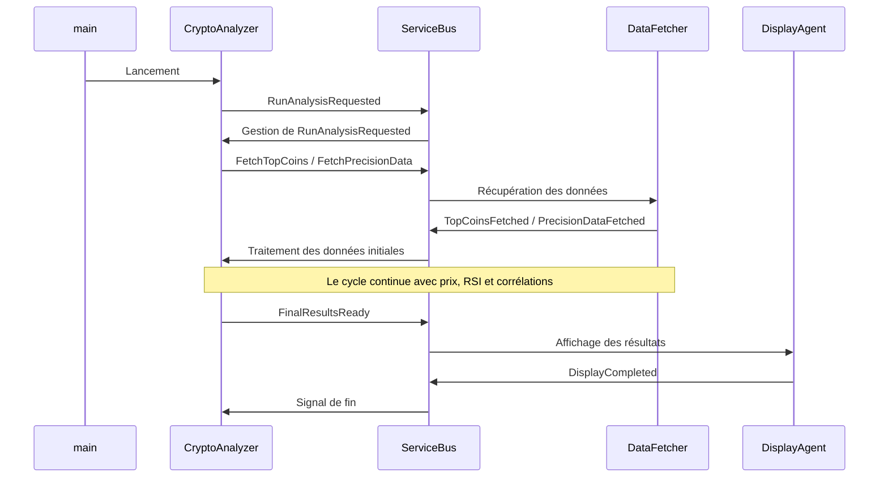

# Analyseur de Corrélation RSI pour Cryptomonnaies

Ce projet est un outil d'analyse de marché pour les cryptomonnaies. Son objectif principal est d'identifier les altcoins à faible capitalisation de marché dont l'
indicateur technique RSI (Relative Strength Index) présente une forte corrélation avec celui du Bitcoin sur différentes unités de temps (timeframes).

L'application est conçue avec une architecture événementielle et multi-threadée pour des performances optimales et une grande modularité.

## Fonctionnalités Principales

- **Collecte de Données Multi-sources** : Récupère la liste des cryptomonnaies et leur capitalisation depuis l'API CoinGecko, et les données de prix historiques (OHLCV)
  depuis l'API de Binance.
- **Analyse Multi-Timeframe** : Capable de lancer des analyses en parallèle sur plusieurs unités de temps (ex: `1h`, `4h`, `1d`).
- **Calcul d'Indicateurs Techniques** : Calcule le RSI pour chaque cryptomonnaie sur la période demandée.
- **Analyse de Corrélation** : Calcule le coefficient de corrélation de Pearson entre le RSI de chaque altcoin et celui du Bitcoin.
- **Filtrage Intelligent** : Isole les résultats pertinents en se basant sur des seuils configurables :
    - Seuil de corrélation (ex: corrélation > 0.7).
    - Appartenance au quartile des faibles capitalisations de marché.
- **Persistance des Données** : Toutes les données collectées (métadonnées des tokens, prix, RSI) et les résultats d'analyse (corrélations) sont systématiquement
  enregistrés dans une base de données SQLite pour chaque session d'analyse.
- **Architecture Robuste et Évolutive** : Construit autour d'un bus de services (`ServiceBus`), chaque composant (collecte, calcul, BDD, affichage) fonctionne de manière
  indépendante dans son propre thread.

## Architecture

Le projet utilise une architecture événementielle pour découpler ses composants. Un orchestrateur central, `CryptoAnalyzer`, dirige le flux de travail en publiant et en
s'abonnant à des événements via un `ServiceBus`. Les tâches spécifiques sont déléguées à des "workers" spécialisés.

- **`ServiceBus`** : File d'attente d'événements centrale et thread-safe. Il reçoit les événements publiés par les composants et les distribue aux abonnés.
- **`CryptoAnalyzer`** : L'orchestrateur. Il ne réalise aucune tâche lourde mais maintient l'état de l'analyse et dicte la séquence des opérations en réponse aux
  événements.
- **`DataFetcher`** : Worker responsable de tous les appels API externes (CoinGecko, Binance).
- **`RSICalculator`** : Worker qui effectue les calculs du RSI.
- **`DatabaseManager`** : Worker qui gère toutes les transactions avec la base de données SQLite (`crypto_data.db`).
- **`DisplayAgent`** : Worker qui met en forme et affiche les résultats finaux dans la console.

Ce modèle permet d'ajouter ou de modifier des fonctionnalités facilement. Par exemple, pour ajouter des notifications par email, il suffirait de créer un `EmailNotifier`
qui s'abonne à l'événement `FinalResultsReady` sans modifier aucun autre composant.

### Schéma du flux d'événements



## Structure du Projet

```

.
├── main.py                     \# Point d'entrée de l'application. Configure et lance l'analyse.
├── crypto\_analyzer.py          \# Orchestrateur principal de l'analyse.
├── configuration.py            \# Contient la classe de configuration `AnalysisConfig`.
├── service\_bus.py              \# Implémentation du bus de services événementiel.
├── events.py                   \# Définition de tous les événements (dataclasses) utilisés dans l'application.
├── data\_fetcher.py             \# Service pour récupérer les données depuis les APIs externes.
├── rsi\_calculator.py           \# Service pour calculer le RSI.
├── database\_manager.py         \# Service pour gérer la base de données SQLite.
├── display\_agent.py            \# Service pour afficher les résultats finaux.
├── analysis\_job.py             \# Classe qui gère l'état d'une analyse pour un seul timeframe.
└── logger.py                   \# Configuration du logging.

````

## Prérequis

- Python 3.8+
- Les dépendances listées dans `requirements.txt`.

## Installation

1. Clonez le dépôt :
   ```sh
   git clone <url-du-repo>
   cd <nom-du-repo>
   ```

2. Il est recommandé de créer et d'activer un environnement virtuel :
   ```sh
   python -m venv venv
   source venv/bin/activate  # Sur Windows: venv\Scripts\activate
   ```

3. Installez les dépendances. Créez un fichier `requirements.txt` avec le contenu suivant :
   ```txt
   pandas
   pycoingecko
   ccxt
   tenacity
   numpy
   ```
   Puis installez-le :
   ```sh
   pip install -r requirements.txt
   ```

## Configuration

Tous les paramètres de l'analyse peuvent être modifiés directement dans le fichier `main.py` au sein de l'objet `AnalysisConfig`.

```python
# main.py

analysis_config = AnalysisConfig(
    weeks=50,  # Nombre de semaines de données historiques à analyser.
    top_n_coins=5000,  # Nombre de top cryptos à considérer (par capitalisation).
    correlation_threshold=0.7,  # Seuil minimum de corrélation pour afficher un résultat.
    rsi_period=14,  # Période pour le calcul du RSI (standard = 14).
    timeframes=['1h', '1d'],  # Liste des unités de temps à analyser.
    low_cap_percentile=25.0  # Percentile pour définir une "faible capitalisation".
    # (25.0 = le 25% des cryptos avec la plus faible capitalisation).
)
````

## Utilisation

Pour lancer une session d'analyse, exécutez simplement le script `main.py` :

```sh
python main.py
```

L'application affichera des logs en temps réel sur sa progression. À la fin, elle affichera un résumé des cryptomonnaies qui correspondent aux critères de sélection.

## Sortie

L'application produit deux types de sortie :

1. **Affichage Console** : Un résumé des résultats finaux, triés par corrélation décroissante, est affiché dans le terminal.

   ```
   INFO - Tokens à faible capitalisation avec forte corrélation RSI avec BTC (50 semaines, timeframes: 1h, 1d) :
   INFO - Coin: some-coin/SOME, Correlation RSI: 0.853, Market Cap: $1,234,567.89
   INFO - Coin: another-coin/OTHER, Correlation RSI: 0.781, Market Cap: $2,345,678.90
   ...
   ```

2. **Base de Données SQLite** : Un fichier `crypto_data.db` est créé (ou mis à jour) à la racine du projet. Il contient les tables suivantes, peuplées avec les données de
   la session (identifiées par un `session_guid`) :

    - `tokens` : Métadonnées de chaque crypto analysée.
    - `precision_data` : Données de marché de Binance.
    - `prices` : Données OHLCV pour chaque crypto et timeframe.
    - `rsi` : Valeurs RSI calculées pour chaque crypto et timeframe.
    - `correlations` : Les résultats finaux de l'analyse de corrélation.

## Notes

### Architecture

L'architecture est l'un des points forts de ce code. Elle est conçue autour d'un **bus de services (`ServiceBus`)**, ce qui la rend modulaire, découplée et évolutive.

1. **Orchestrateur Central (`CryptoAnalyzer`)** : C'est le cerveau de l'application. Il ne fait pas le travail lui-même, mais il orchestre le flux de travail en écoutant
   des événements et en en publiant de nouveaux. Il maintient l'état global de l'analyse.

2. **Services Spécialisés (Workers)** : Chaque tâche lourde ou spécifique (accès réseau, calcul, accès BDD) est déléguée à un composant dédié qui s'exécute dans son
   propre thread :

    * `DataFetcher`: Récupère toutes les données externes (liste des cryptos depuis CoinGecko, prix historiques et données de précision depuis Binance).
    * `RSICalculator`: Effectue les calculs mathématiques pour le RSI.
    * `DatabaseManager`: Gère toutes les interactions avec la base de données SQLite (création de tables, insertions).
    * `DisplayAgent`: Se charge de la présentation finale des résultats.

3. **Communication par Événements (`ServiceBus` et `events.py`)** :

    * Les composants ne communiquent jamais directement entre eux. Ils publient des événements sur le `ServiceBus` (ex: `DataFetcher` publie `TopCoinsFetched`).
    * Les composants s'abonnent aux événements qui les intéressent (ex: `CryptoAnalyzer` s'abonne à `TopCoinsFetched` pour savoir quand il peut continuer le processus).
    * Les événements (`events.py`) sont des `dataclasses` typées, ce qui rend le code propre et robuste.
    * Le `ServiceBus` traite les événements de manière séquentielle dans son propre thread, ce qui garantit un ordre de traitement logique et évite les conditions de
      concurrence complexes au niveau de la logique métier.

### Flux d'Exécution

1. **Initialisation (`main.py`)**: Crée une configuration (`AnalysisConfig`) et l'orchestrateur (`CryptoAnalyzer`). Un GUID de session unique est généré.
2. **Démarrage (`CryptoAnalyzer.run`)**:
    * Tous les services (DataFetcher, RSICalculator, etc.) sont démarrés dans leurs threads respectifs.
    * Un événement `AnalysisConfigurationProvided` est publié pour que tous les services connaissent la configuration et le GUID de la session.
    * Un événement `RunAnalysisRequested` est publié pour lancer le processus.
3. **Collecte des Données Initiales**:
    * `CryptoAnalyzer` reçoit `RunAnalysisRequested` et demande la liste des N top cryptos et les données de précision de Binance.
    * `DataFetcher` reçoit ces requêtes, effectue les appels API (avec des re-tentatives en cas d'échec réseau) et publie les résultats (`TopCoinsFetched`,
      `PrecisionDataFetched`).
4. **Lancement des Analyses par Timeframe**:
    * `CryptoAnalyzer` reçoit les données initiales, filtre les cryptos pour ne garder que celles qui ont une paire en USDC sur Binance, puis sauvegarde leurs métadonnées
      via un événement `SingleCoinFetched`.
    * Pour chaque `timeframe` configuré (ex: '1h', '1d'), il crée un `AnalysisJob`.
    * Pour chaque `job`, il publie des événements `FetchHistoricalPricesRequested` pour Bitcoin et pour chaque autre crypto à analyser.
5. **Calcul et Corrélation**:
    * `DataFetcher` récupère les prix et publie `HistoricalPricesFetched`.
    * `CryptoAnalyzer` reçoit les prix et publie `CalculateRSIRequested`.
    * `RSICalculator` reçoit la requête, calcule le RSI et publie `RSICalculated`.
    * `DatabaseManager` écoute en permanence les événements (`HistoricalPricesFetched`, `RSICalculated`, etc.) et sauvegarde les données en arrière-plan sans bloquer le
      flux principal.
6. **Agrégation et Finalisation**:
    * La classe `AnalysisJob` suit la progression de chaque `timeframe`. Lorsqu'il a reçu tous les RSI nécessaires (celui du BTC et ceux des autres cryptos), il lance
      l'analyse de corrélation.
    * Les résultats de corrélation significatifs sont publiés via `CorrelationAnalyzed`.
    * Lorsque le `AnalysisJob` a terminé, il publie `AnalysisJobCompleted`.
    * `CryptoAnalyzer` compte les `AnalysisJobCompleted`. Quand tous les timeframes sont terminés, il publie `FinalResultsReady`.
7. **Affichage et Arrêt**:
    * `DisplayAgent` reçoit `FinalResultsReady`, affiche un résumé clair dans la console et publie `DisplayCompleted`.
    * `CryptoAnalyzer` reçoit `DisplayCompleted`, ce qui débloque le thread principal.
    * Le programme s'arrête proprement en stoppant tous les services.

### Points Forts du Code

* **Découplage Fort** : L'utilisation du `ServiceBus` est excellente. Ajouter un nouveau service (par exemple, un notificateur par email) ne nécessiterait que de créer la
  classe et de l'abonner aux événements pertinents, sans modifier les autres composants.
* **Concurrence Gérée Proprement** : L'isolation des tâches I/O-bound (réseau, BDD) et CPU-bound (calcul RSI) dans des threads séparés est une bonne pratique. La
  communication via des files d'attente (`queue.Queue`) est thread-safe. Pour plus de détails sur l'architecture threading,
  consultez [THREADING_AGENTS.md](threading_agents.md).
* **Robustesse** : L'utilisation de `tenacity` pour les appels réseau et la gestion des erreurs (ex: `CoinProcessingFailed`) rendent le script plus résistant aux pannes.
* **Configuration Centralisée** : `AnalysisConfig` permet de modifier facilement les paramètres de l'analyse sans toucher au code principal.
* **Persistance des Données** : Tout est sauvegardé dans une base de données SQLite, ce qui permet une analyse post-mortem ou la réutilisation des données.

## Stack

[](https://skillicons.dev)